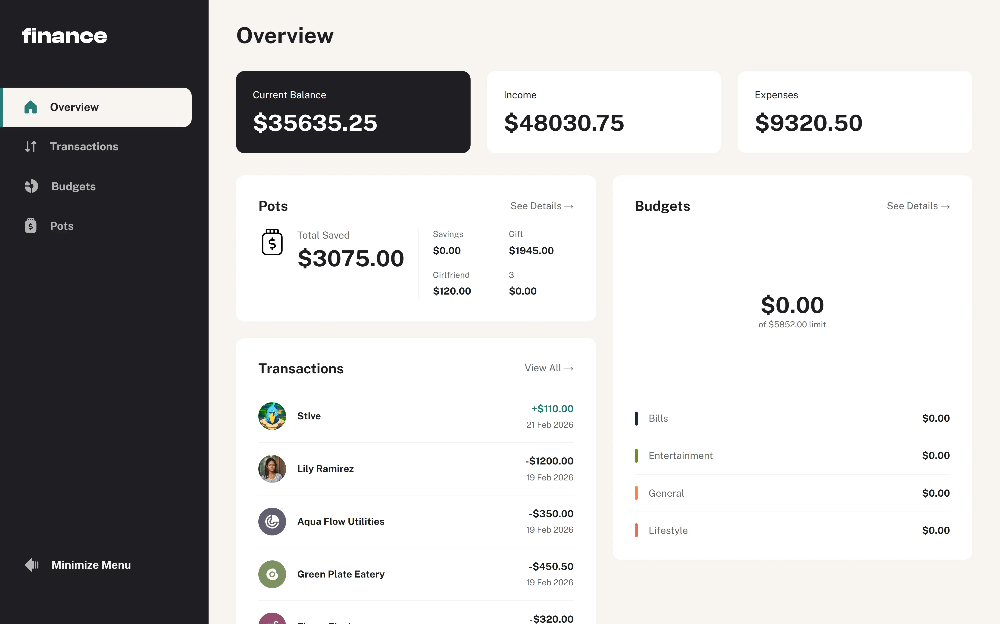
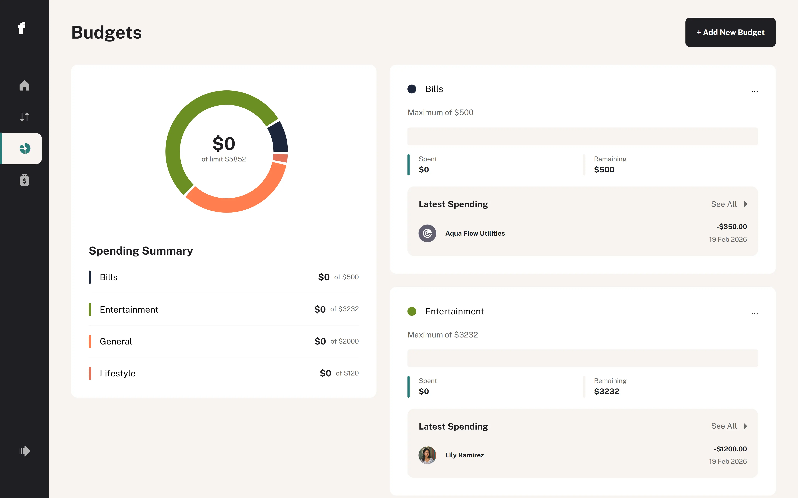
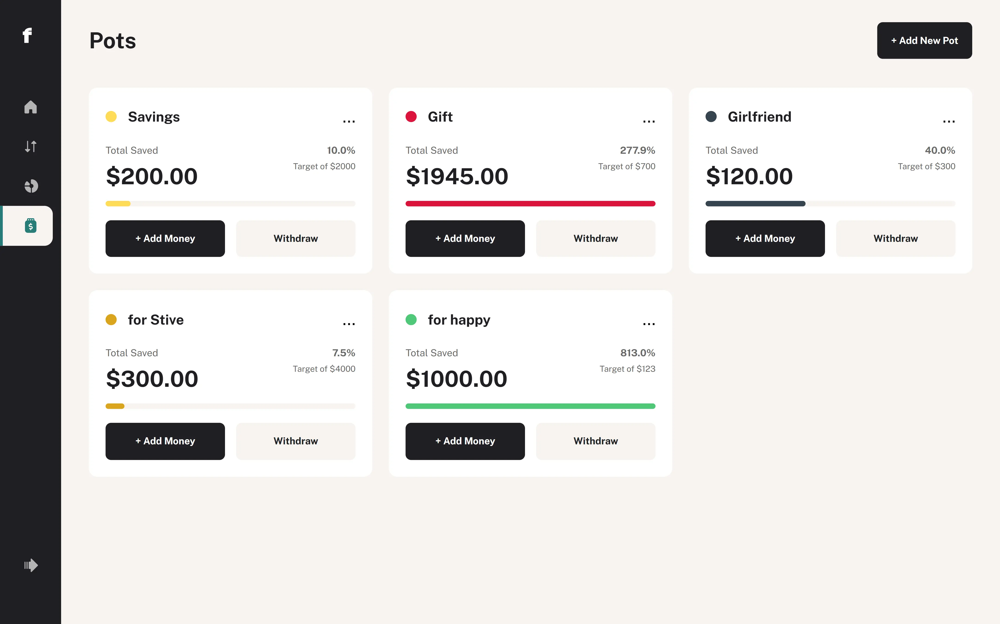

# Personal Finance

Full-stack financial tracker with budgets, transactions, and multiple accounts.

## 📸 Screenshots

## ✨ Features
- Account balance and transaction tracking
- Expense distribution by categories and budgets
- Add, edit, and delete pots
- Global state management via React Context
- REST API integration with FastAPI backend

## 🛠️ Tech Stack
**Frontend:** React, TypeScript, React Router, React Context, Framer Motion, SCSS

[**Backend:**](https://github.com/Trothing/Personal-Finance-Back-v1) FastAPI, Python, SQLite

## ⚙️ Getting Started

### Frontend
git clone https://github.com/Trothing/Personal-Finance-Front-v1.git

cd Personal-Finance-Front-v1

npm install

npm run dev
